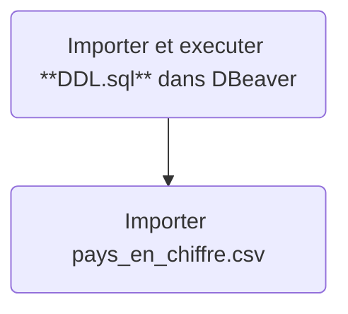



# Pays en chiffre

"Pays en chiffre" est une base de donnée permettant d'observer plusieurs informations autour des population de 135 pays.

## Installation

Il faut utiliser importer et executer **DDL.sql** dans DBeaver
puis importer pays_en_chiffre.csv de la manière suivante:

- Utiliser directement le fichier **pays_en_chiffre.odt** 
- Ou ouvrir un nouveau fichier calc *(libre office)*
Use the package manager [pip](https://pip.pypa.io/en/stable/) to install foobar.

```bash
pip install foobar
```

## Usage

```python
import foobar

foobar.pluralize('word') # returns 'words'
foobar.pluralize('goose') # returns 'geese'
foobar.singularize('phenomena') # returns 'phenomenon'
```
